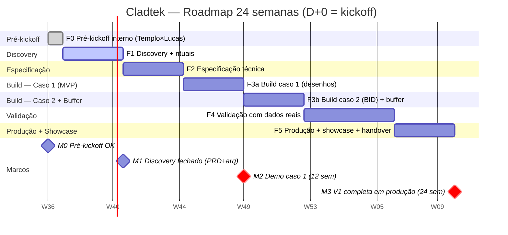

# Roadmap — Cladtek (Sistema Agêntico de Engenharia)

> **Documento vivo.** Última atualização: 2026-07-29
> **Status:** Rascunho v0.1 — criado a partir do escopo contratual (Templo × Cladtek)
> **Origem:** cláusulas contratuais — Lucas Cid, responsável técnico

---

## 1. Restrições contratuais que moldam o roadmap

| Restrição | Valor | Implicação |
|---|---|---|
| **Prazo máximo total** | **24 semanas** | Hard cap |
| **Entrega intermediária** | **12 semanas** | Marco M2 obrigatório |
| **Discovery** | **4 semanas** | Marco M1 — antes de qualquer build |
| **Rituais inclusos** | Kickoff, weekly, workshop, 10 entrevistas, showcase | Tempo e energia precisam ser orçados |
| **Custo IA total** | R$ 10k (soma dos 2 projetos) | Teto compartilhado com SENAC |
| **Custo IA mensal** | R$ 3k/mês (1 projeto) | Teto mensal; controlar tokens |
| **Forma de pagamento** | 3 parcelas, liberadas após Templo receber do cliente | Fluxo vinculado ao recebimento do Templo |
| **Casos de uso** | 2 (desenhos + BID) no mesmo sistema | Escopo maior que projeto típico de 24s |

> **Premissa:** dada a complexidade (2 casos de uso), o caso 1 (desenhos) é o candidato natural a MVP da semana 12. O caso 2 (BID) pode ser faseado para a segunda metade.

---

## 2. Fases

### F0 — Pré-kickoff interno (Templo × Lucas)
> **Semana 0** (pré-contrato / D-7 do kickoff)

- [ ] Alinhar expectativas Templo ↔ Lucas
- [ ] **Decidir stack:** N8N (contratual) vs Agno (padrão interno)
- [ ] Definir LLM (precisa de visão + texto)
- [ ] Confirmar design system do Templo para interface
- [ ] Definir canais de comunicação
- [ ] Setup do repo `CidLucas/cladtek` com CI mínimo

---

### F1 — Discovery (com cliente)
> **Semanas 1–4** (marco M1)

**Objetivo:** fechar o escopo da V1 e arquitetura. Priorizar os 2 casos de uso.

#### Trilha técnica
- [ ] **Acesso a amostras reais** — desenhos (SolidWorks/PDL/PDF) + RFQs + parâmetros Cladtek
- [ ] **Testar extração de dados** dos formatos reais (visão computacional? OCR? API nativa?)
- [ ] **Definir base semântica** — onde armazenar parâmetros Cladtek + capacidades internas
- [ ] **Definir LLM** (testar com amostras reais)
- [ ] **Decidir auth** (~20 usuários)
- [ ] **Priorizar casos de uso** — MVP da semana 12 = caso 1 (desenhos)?
- [ ] **Criar PRD fechado** + arquitetura técnica

#### Trilha de produto
- [ ] **Mapear personas** com engenharia Cladtek
- [ ] **Coletar parâmetros Cladtek** documentados
- [ ] **Acordar métricas de sucesso** (SLA atual de revisão, meta)
- [ ] **Definir projeto-piloto** (1 tipo de desenho, 1 tipo de RFQ)

#### Trilha de gestão
- [ ] **Workshop de discovery** (presencial ou online)
- [ ] **10 entrevistas online** com engenharia
- [ ] **Weekly online** com GP Templo (semanas alternadas com cliente)

#### Marco M1 (semana 4)
✅ PRD fechado + arquitetura aprovada + amostras reais em mãos + priorização dos casos definida.

---

### F2 — Especificação
> **Semanas 5–8**

**Objetivo:** transformar discovery em plano executável.

- [ ] **Schema do modelo de dados** (desenho, parâmetro, RFQ, laudo, technical comment)
- [ ] **Contratos de API** (FastAPI): `/drawings`, `/rfqs`, `/reports`, `/chat`, `/dashboard`
- [ ] **Pipeline de extração de desenho** (SolidWorks/PDL/PDF → dados estruturados)
- [ ] **Pipeline de parsing de RFQ** (PDF/DOC → requisitos estruturados)
- [ ] **Pipeline de comparação** (dados extraídos vs. parâmetros Cladtek)
- [ ] **Pipeline de cruzamento BID** (RFQ vs. capacidades internas)
- [ ] **Pipeline do bot consultor** (Q&A sobre base de desenhos + BIDs)
- [ ] **Pipeline de dashboard** (agregação por área, tipo, período)
- [ ] **Plano de testes** + golden set com pareceres humanos anotados
- [ ] **Projeção de custo de tokens** e validação contra teto R$ 3k/mês

#### Marco intermediário (semana 8)
✅ Especificação técnica pronta + plano de build validado com Templo (AI Officer).

---

### F3 — Build V1 (MVP = Caso 1; Caso 2 em paralelo)
> **Semanas 9–14** (marco intermediário M2 = semana 12)

**Objetivo:** V1 funcional com o caso 1 (desenhos) rodando. Caso 2 (BID) iniciado.

#### MVP — Caso 1: Revisão de desenhos (semanas 9–12)
- [ ] **Ingestor de desenhos** (adapter SolidWorks/PDL/PDF)
- [ ] **Extrator de dados** (cotas, tolerâncias, notas)
- [ ] **Engine de comparação** (regras + LLM)
- [ ] **Gerador de laudo** (✅/⚠️/❌ + justificativas)
- [ ] **Interface de revisão humana** (sandbox)
- [ ] **Auth** (login)
- [ ] **UI mínimo** (Templo fornece design system)
- [ ] **Deploy em ambiente de teste** (infra Templo)
- [ ] **Testes E2E** (ingestão → extração → laudo → revisão humana)

#### Caso 2: Análise de BID (semanas 11–14, início)
- [ ] **Parser de RFQ**
- [ ] **Base de capacidades Cladtek** (ingestão)
- [ ] **Engine de cruzamento** (RFQ × capacidades)

#### Marco M2 (semana 12)
✅ **Demo fim-a-fim do caso 1 (desenhos) em ambiente de teste.** Entrega contratual.

#### Semanas 13–14 (buffer)
- [ ] Ajustes pós-demo Templo + Cladtek
- [ ] Avanço no caso 2 (BID)
- [ ] Hardening de segurança

---

### F4 — Build V2 + Validação
> **Semanas 15–20**

**Objetivo:** caso 2 (BID) funcional + validação de ambos com dados reais.

- [ ] **Finalizar caso 2 (BID)** — parser, cruzamento, technical comment, sandbox
- [ ] **Bot consultor unificado** (fala com base de desenhos + BIDs)
- [ ] **Dashboard agregado** (ambos os casos)
- [ ] **Relatórios por área** (diferentes formatos)
- [ ] **Piloto com projeto real** (Cladtek)
- [ ] **Coleta de feedback** (entrevistas + survey com engenheiros)
- [ ] **Ajustes de prompt/pipeline** com base no feedback
- [ ] **Medição das métricas de sucesso**

---

### F5 — Produção + Showcase
> **Semanas 21–24** (marco M3 = semana 24)

**Objetivo:** V1 completa em produção + showcase.

- [ ] **Deploy produção** (infra Templo)
- [ ] **Onboarding dos ~20 usuários**
- [ ] **Monitoramento de custo de IA** (alerta se > R$ 3k/mês)
- [ ] **Monitoramento de qualidade** (Langfuse + alertas)
- [ ] **Documentação para Cladtek** (manual de uso + troubleshooting)
- [ ] **Showcase de apresentação de resultados** (ritual contratual)
- [ ] **Handover para Templo** (incluindo nota: integração ao Orchestra é fora do escopo)
- [ ] **Pagamento:** parcela final liberada após Templo receber da Cladtek

#### Marco M3 (semana 24)
✅ V1 completa em produção + showcase entregue + handover + pagamento.

---

## 3. Marcos (milestones) — visão consolidada

| Marco | Semana | Entrega | Status |
|---|---|---|---|
| M0 | 0 | Pré-kickoff interno OK | 🔴 |
| M1 | 4 | Discovery fechado, PRD + arquitetura | 🔴 |
| — | 8 | Especificação técnica validada | 🔴 |
| M2 | 12 | **Demo fim-a-fim caso 1 (desenhos)** (entrega contratual) | 🔴 |
| — | 14 | Buffer + início caso 2 (BID) | 🔴 |
| — | 20 | Validação completa (ambos os casos) | 🔴 |
| M3 | 24 | **V1 completa em produção + showcase** (entrega contratual) | 🔴 |

---

## 4. Linha do tempo (Gantt)

**Notas sobre a timeline:**
- D+0 = data do kickoff (a definir com Cladtek — depende de assinatura do contrato).
- Placeholder: **2026-09-01** (assumindo assinatura em ~15-30 dias a partir de 29/07).
- M2 focado no caso 1 (desenhos) como MVP contratual da semana 12.
- Caso 2 (BID) pode ser antecipado se o discovery indicar que é mais simples que o esperado.

---

## 5. Tarefas de alto nível por fase

| Fase | Tarefa | Owner | Dependência |
|---|---|---|---|
| F0 | Setup repo `CidLucas/cladtek` | Lucas | — |
| F0 | Decidir N8N vs Agno | Lucas | — |
| F0 | Provisionar infra para dev | Templo | — |
| F1 | Acesso a desenhos + RFQs reais | Lucas + Cladtek | Kickoff |
| F1 | Workshop discovery | Lucas + Templo + Cladtek | — |
| F1 | 10 entrevistas com engenharia | Lucas | Workshop |
| F1 | Teste de LLM em amostras reais | Lucas | Amostras |
| F2 | Schema modelo de dados | Lucas | F1 |
| F2 | Contrato de API FastAPI | Lucas | Schema |
| F2 | Plano de testes + golden set | Lucas | Amostras |
| F2 | Projeção de custo de tokens | Lucas | LLM escolhido |
| F3a | Ingestor + extrator de desenhos | Lucas | F2 |
| F3a | Engine de comparação | Lucas | F2 |
| F3a | Gerador de laudo | Lucas | F2 |
| F3a | Interface de revisão humana | Lucas + Templo | F2 |
| F3a | Auth + UI mínimo | Lucas + Templo | F2 |
| F3b | Parser de RFQ | Lucas | M2 |
| F3b | Engine de cruzamento BID | Lucas | M2 |
| F3b | Gerador de Technical Comment | Lucas | M2 |
| F4 | Bot consultor unificado | Lucas | F3a+F3b |
| F4 | Dashboard agregado | Lucas | F2 |
| F4 | Piloto com projeto real | Lucas + Cladtek | M2 |
| F4 | Coleta de feedback | Lucas | Piloto |
| F5 | Deploy produção | Templo | F4 OK |
| F5 | Onboarding usuários | Lucas + Cladtek | Deploy |
| F5 | Showcase | Lucas + Templo + Cladtek | Tudo |

---

## 6. Riscos do roadmap

| Risco | Impacto | Mitigação | Fase |
|---|---|---|---|
| **2 casos de uso em 24s é apertado** | Alto | Priorizar caso 1 como MVP (semana 12); caso 2 na segunda metade | F1 |
| **Extração de desenhos técnicos é complexa** | Alto | Testar com amostras reais no discovery; fallback: OCR + LLM multimodal | F1 |
| **Formato das RFQs é variável** | Médio | Parser flexível + sandbox de validação humana | F1→F3b |
| **Templo atrasa design system** | Médio | Começar com UI mínima funcional; design system pode vir depois | F3a |
| **Custo de IA estoura R$ 3k/mês** | Médio | Cache, batch, modelo mais barato para consultas; alerta Langfuse | F3→F5 |
| **Engenheiro não confia no sistema** | Alto | Sandbox sempre; palavra final é humana; entrevistas em F1 | F1→F4 |
| **Contrato Cladtek atrasa** | Alto | Fora do nosso controle; manter docs prontos e aguardar | F0 |

---

## 7. Próximo passo imediato

- [ ] **Lucas** — aguardar assinatura do contrato Cladtek (15-30 dias)
- [x] ~~**Lucas** — decidir N8N vs Agno~~ → Agno confirmado
- [ ] **Hermes** — quando D+0 estiver definido, ajustar Gantt e abrir issues

---

_Atualizar este doc a cada milestone. O Gantt usa data placeholder (2026-09-01) — ajustar quando o kickoff for confirmado._
