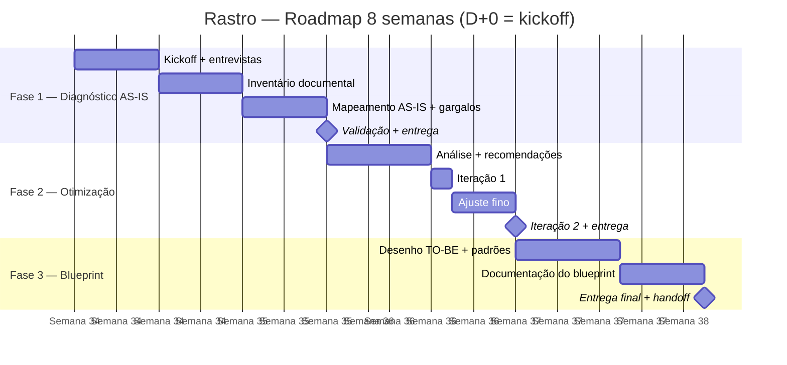

# 03 — Roadmap

## 🗺 Fases

**Duração total: 8 semanas (D+0 = kickoff)**

### Fase 1 — Diagnóstico AS-IS (Semanas 1–3)

**Pagamento:** R$ 7.500 (50%) na entrega

| # | Atividade | Quem | Duração |
|---|---|---|---|
| A1 | Kickoff com a Rastro | Lucas + Rastro | 1h |
| A2 | Entrevistas com 2–3 pessoas-chave do fluxo de propostas | Lucas | 2–3h |
| A3 | Inventário dos documentos usados no processo (templates, propostas passadas, briefings, orçamentos, cases) | Lucas + Rastro | 3–4 dias |
| A4 | Mapeamento do fluxo atual (diagrama AS-IS) | Lucas | 2 dias |
| A5 | Identificação de gargalos e retrabalho | Lucas | 2 dias |
| A6 | Validação do diagnóstico com a Rastro | Lucas → Rastro | 1h |

**Entregáveis Fase 1:**
- Relatório de diagnóstico (PDF)
- Diagrama AS-IS do fluxo de propostas
- Inventário documental comentado

**💰 Pagamento:** R$ 7.500 (50%) na entrega (Semana 3).

---

### Fase 2 — Otimização (Semanas 4–6)

**Pagamento:** sem pagamento próprio (coberto pelas parcelas de 50% da Fase 1 e da Fase 3)

| # | Atividade | Quem | Duração |
|---|---|---|---|
| B1 | Análise de oportunidades por impacto e esforço | Lucas | 2 dias |
| B2 | Definição de recomendações: padronização, templates, convenções, estrutura de pastas | Lucas | 3 dias |
| B3 | Iteração 1 com o time da Rastro | Lucas → Rastro | 1h |
| B4 | Ajuste fino das recomendações com base no retorno | Lucas | 2 dias |
| B5 | Iteração 2 e validação final | Lucas → Rastro | 1h |

**Entregáveis Fase 2:**
- Recomendações priorizadas de otimização do fluxo
- Padrões de templates e convenções

**💰 Pagamento:** sem pagamento próprio (2ª parcela de 50% só na Fase 3).

---

### Fase 3 — Blueprint do novo fluxo (Semanas 7–8)

**Pagamento:** R$ 7.500 (50%) na entrega

| # | Atividade | Quem | Duração |
|---|---|---|---|
| C1 | Desenho do fluxo otimizado (TO-BE) | Lucas | 3 dias |
| C2 | Definição de padrões: templates, referências, pontos de decisão | Lucas | 2 dias |
| C3 | Documentação do blueprint completo | Lucas | 3 dias |
| C4 | Apresentação e handoff para a Rastro | Lucas → Rastro | 1h |

**Entregáveis Fase 3:**
- Blueprint do novo fluxo otimizado
- Guia passo a passo de como criar propostas
- Documento de padrões e templates

**💰 Pagamento:** R$ 7.500 (50%) na entrega (Semana 8).

---

## 📅 Cronograma visual (Gantt)

---

## 🎯 Milestones

| Marco | O quê | Data alvo | Status |
|---|---|---|---|
| **M1** | Diagnóstico AS-IS entregue e aprovado + pagamento 50% | ~Semana 3 | 🔴 |
| **M2** | Otimização entregue e validada (sem pagamento próprio) | ~Semana 6 | 🔴 |
| **M3** | Blueprint do novo fluxo entregue + pagamento final 50% | ~Semana 8 | 🔴 |

---

## ⚠️ Riscos do roadmap

| Risco | Prob. | Impacto | Mitigação |
|---|---|---|---|
| Engajamento do time nas iterações | Média | Alto | Entregáveis em marcos curtos; entrevistas curtas e objetivas |
| Escopo das otimizações crescer | Média | Médio | Priorização por impacto e esforço; gate entre entregáveis |
| Disponibilidade das pessoas-chave | Média | Médio | Calendário das entrevistas agendado no kickoff (D+0) |
| Cliente esperar implementação | Baixa | Médio | Escopo v0.4 explicita: consultoria apenas, sem ferramentas |
