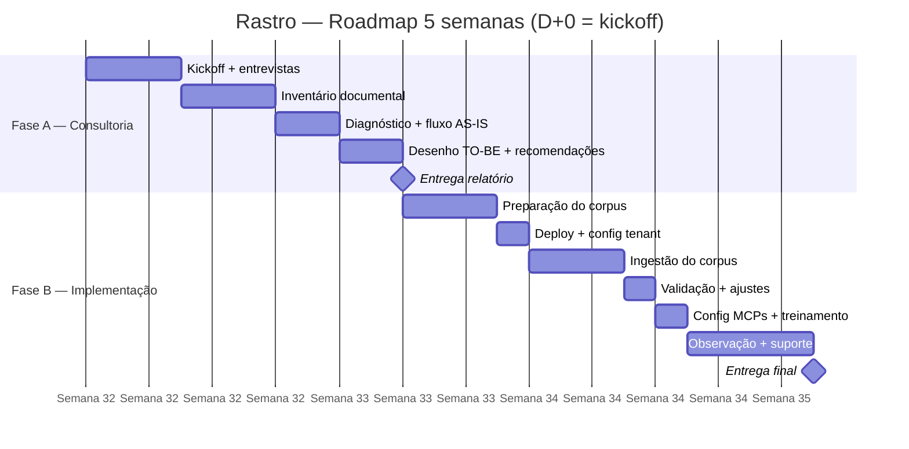

# 03 — Roadmap

## 🗺 Fases

### Fase A — Consultoria de Fluxo de Propostas (Semanas 1–2)

**Duração estimada:** 1–2 semanas
**D+0:** a definir (provável semana de 03/08/2026)

| # | Atividade | Quem | Duração |
|---|---|---|---|
| A1 | Kickoff com stakeholders da Rastro | Lucas + Rastro | 1h |
| A2 | Entrevistas com 2–3 pessoas-chave do time | Lucas | 2–3h |
| A3 | Coleta e inventário de documentos (templates, propostas, briefings, orçamentos, cases) | Lucas + Rastro | 2–3 dias |
| A4 | Mapeamento do fluxo atual (diagrama AS-IS) | Lucas | 1 dia |
| A5 | Identificação de gargalos e oportunidades | Lucas | 1 dia |
| A6 | Desenho do fluxo-alvo (TO-BE) com MCP Brain Lite no centro | Lucas | 1 dia |
| A7 | Recomendações de padronização (templates, pastas, convenções) | Lucas | 1 dia |
| A8 | Entrega do relatório de diagnóstico + apresentação | Lucas → Rastro | 1h |

**Entregáveis Fase A:**
- Relatório de diagnóstico (PDF)
- Diagrama AS-IS / TO-BE
- Inventário documental comentado
- Recomendações priorizadas

**Gate A→B:** Rastro aprova diagnóstico e autoriza continuar para implementação.

---

### Fase B — Implementação MCP Brain Lite (Semanas 3–5)

**Duração estimada:** 2–3 semanas
**Pré-requisito:** Fase A concluída e aprovada + MCP Brain Lite com tools MCP funcionais

| # | Atividade | Quem | Duração |
|---|---|---|---|
| B1 | Preparação do corpus: limpeza, deduplicação, categorização | Lucas (+ curador Rastro) | 2–3 dias |
| B2 | Deploy do MCP Brain Lite: provisionar VPS, configurar gateway, OAuth, escopos | Lucas | 1 dia |
| B3 | Configurar tenant "rastro" com escopos `corp` + `personal/` (5–10 usuários) | Lucas | 0.5 dia |
| B4 | Ingestão do corpus: upload dos documentos no escopo `corp` | Lucas + curador | 2–3 dias |
| B5 | Validação pós-ingestão: testar queries reais, ajustar chunking/embedding se necessário | Lucas | 1 dia |
| B6 | Configurar MCP nos Claude Desktop do time (5–10 pessoas) | Lucas | 1 dia |
| B7 | Treinamento do time: como consultar, como contribuir, boas práticas | Lucas → Rastro | 1h |
| B8 | Período de observação: suporte a dúvidas, ajustes finos | Lucas | 3–5 dias |
| B9 | Entrega final: documento de boas práticas + handoff | Lucas → Rastro | — |

**Entregáveis Fase B:**
- Gateway MCP Brain Lite em produção
- Corpus documental ingerido (grafo de conhecimento ativo)
- 5–10 Claude Desktops conectados
- Sessão de treinamento realizada
- Documento de boas práticas (manutenção do corpus, curadoria, onboarding de novas pessoas)

---

## 📅 Cronograma visual (Gantt)

---

## 🎯 Milestones

| Marco | O quê | Data alvo | Status |
|---|---|---|---|
| **M1** | Relatório de diagnóstico entregue e aprovado (Fim Fase A) | ~2026-08-14 | 🔴 |
| **M2** | Time conectado + corpus vivo + treinamento concluído (Fim Fase B) | ~2026-09-04 | 🔴 |

---

## ⚠️ Riscos do roadmap

| Risco | Prob. | Impacto | Mitigação |
|---|---|---|---|
| **MCP Brain Lite não ter tools MCP prontas** | Média | Alto | Iniciar Fase B só após confirmação. Plano B: usar MCP Brain (Turso) como fallback |
| **Corpus desorganizado/deduplicado** | Alta | Médio | Fase A inclui inventário → já saímos com mapa do que ingerir. Dedicar tempo realista à limpeza |
| **Atraso na aprovação da Rastro entre fases** | Média | Médio | Gate A→B claro. Proposta comercial já prevê as duas fases, sem surpresa |
| **Time não adota** | Baixa | Alto | Eles já usam Claude → adoção é natural. Treinamento + suporte na primeira semana |
| **Vazamento de dados sensíveis** | Baixa | Crítico | Escopo `corp` com curadoria humana. Sem ingestão automática. Audit log ativo |
