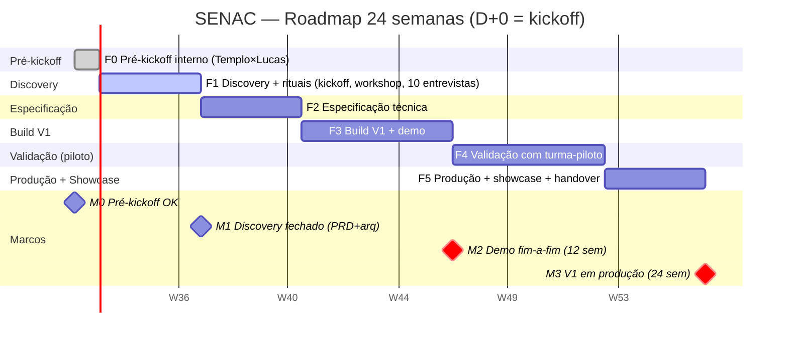

# Roadmap — SENAC (Relatórios de Diário de Bordo com IA)

> **Documento vivo.** Última atualização: 2026-07-22
> **Status:** Rascunho v0.1 — para discussão
> **Origem:** cláusulas contratuais (Templo × SENAC) — Lucas Cid, responsável técnico

---

## 1. Restrições contratuais que moldam o roadmap

| Restrição | Valor | Implicação |
|---|---|---|
| **Prazo máximo total** | **24 semanas** | Hard cap |
| **Entrega intermediária** | **12 semanas** | Marco M2 obrigatório |
| **Discovery** | **4 semanas** | Marco M1 — antes de qualquer build |
| **Rituais inclusos** | Kickoff, weekly, workshop, 10 entrevistas, showcase | Tempo e energia precisam ser orçados |
| **Custo IA total** | R$ 10k (soma dos 2 projetos) | Teto compartilhado com Cladtek |
| **Custo IA mensal** | R$ 3k/mês (1 projeto) | Teto mensal; controlar tokens |
| **Forma de pagamento** | Final, após Templo receber do cliente | Sem fluxo de caixa antecipado pra Lucas |

> **Premissa:** o discovery e rituais ocupam ~30% do tempo das 4 primeiras semanas. O build efetivo começa efetivamente na semana 5.

---

## 2. Fases

### F0 — Pré-kickoff interno (Templo × Lucas)
> **Semana 0** (pré-contrato / D-7 do kickoff)

- [ ] Alinhar expectativas Templo ↔ Lucas
- [ ] Confirmar stack base (Agno, OCI GenAI, OCI Vector Store)
- [ ] Confirmar credenciais OCI provisionadas pelo Templo
- [ ] Definir canais de comunicação (Telegram Templo? Slack? grupo dedicado?)
- [ ] Setup do repo de código (`CidLucas/senac`) com CI mínimo

---

### F1 — Discovery (com cliente)
> **Semanas 1–4** (marco M1)
> **Entregas rituais:** kickoff presencial + workshop discovery + 10 entrevistas

**Objetivo:** fechar o escopo da V1 e a arquitetura de alto nível.

#### Trilha técnica
- [ ] **Acesso ao SAVE** — entender formato, periodicidade e campos do export
- [ ] **Levantar 2-3 amostras reais** de diário de classe + relatório final atual (do pedagogo)
- [ ] **Decidir fonte de auth** (Cognito? SSO SENAC? Auth0?)
- [ ] **Decidir formato final do relatório editável** (Google Docs API? .docx? ambos?)
- [ ] **Definir LLM** (Grok vs Llama) com base em teste de qualidade em 5 relatórios reais
- [ ] **Definir vector store** (manter OCI vs. ir de Turso)
- [ ] **Criar PRD fechado** (este doc) e arquitetura técnica em `02-arquitetura.md`

#### Trilha de produto
- [ ] **Mapear personas** com pedagogia (confirmar fluxo de validação)
- [ ] **Coletar matriz de competências** da turma-piloto
- [ ] **Acordar métricas de sucesso** com SENAC (NPS, tempo, taxa de aproveitamento)
- [ ] **Definir turma-piloto** (1 turma, 1 professor, 1 pedagogo)

#### Trilha de gestão
- [ ] **Workshop de discovery presencial** (ritual contratual)
- [ ] **10 entrevistas online** com pedagogia (ritual contratual)
- [ ] **Weekly online** com GP Templo (semanas alternadas com cliente)

#### Marco M1 (semana 4)
✅ PRD fechado + arquitetura aprovada + turma-piloto definida + amostras de relatório real em mãos.

---

### F2 — Especificação
> **Semanas 5–8**

**Objetivo:** transformar discovery em plano executável.

- [ ] **Schema do modelo de dados** (aluno, turma, diário, competência, relatório)
- [ ] **Contratos de API** (FastAPI): `/ingest`, `/reports`, `/reports/{id}`, `/chat`, `/dashboard`
- [ ] **Pipeline de ingestão** (CSV/XLSX do SAVE → chunk → embed → vector store)
- [ ] **Pipeline de geração de relatório** (RAG + LLM, formato oficial, rastro por afirmação)
- [ ] **Pipeline de Q&A** (agent conversacional sobre base agregada)
- [ ] **Pipeline de dashboard** (agregação por turma / período / competência)
- [ ] **Plano de testes** + golden set de 5-10 relatórios reais com "esperado" anotado
- [ ] **Setup de observabilidade** (Langfuse já disponível)
- [ ] **Custos: projetar uso de tokens** da V1 e validar contra teto R$ 3k/mês

#### Marco intermediário (semana 8)
✅ Especificação técnica pronta + plano de build validado com Templo (AI Officer).

---

### F3 — Build V1
> **Semanas 9–14** (marco intermediário M2 = semana 12)

**Objetivo:** V1 funcional rodando em ambiente de teste com 1 turma-piloto.

- [ ] **Repo de código setup** (FastAPI + Agno + estrutura padrão `agente-bloquo`)
- [ ] **Ingestor SAVE** (adapter + testes de contrato)
- [ ] **Agente gerador de relatório** (RAG + LLM + formatação oficial + rastro)
- [ ] **Agente Q&A** sobre base agregada
- [ ] **Endpoint `/reports`** com geração assíncrona (job + polling ou webhook)
- [ ] **Endpoint `/dashboard`** (agregação + filtros)
- [ ] **Auth** (login pedagogo)
- [ ] **UI mínimo** (Templo define se há design system; se não, web app enxuto)
- [ ] **Editabilidade do relatório** (export Google Docs ou .docx)
- [ ] **Deploy em ambiente de teste** (infra Templo)
- [ ] **Testes E2E** (ingestão → geração → revisão → export)

#### Marco M2 (semana 12)
✅ Demo fim-a-fim funcionando em ambiente de teste. **Entrega intermediária contratual.**

#### Semanas 13–14 (buffer)
- [ ] Ajustes pós-demo Templo + SENAC
- [ ] Hardening de segurança
- [ ] Documentação interna

---

### F4 — Validação (piloto real)
> **Semanas 15–20**

**Objetivo:** validar com a turma-piloto real e calibrar.

- [ ] **Piloto com turma-piloto** (1 turma, 1 professor, 1 pedagogo)
- [ ] **Coleta de feedback qualitativo** (entrevistas + survey)
- [ ] **Ajustes de prompt / pipeline** com base no feedback
- [ ] **Medição das métricas de sucesso** definidas no discovery
- [ ] **Calibração da matriz de competências** (se aplicável)
- [ ] **2ª iteração de build** (apenas correções e melhorias de UX)

---

### F5 — Produção + Showcase
> **Semanas 21–24** (marco M3 = semana 24)

**Objetivo:** V1 em produção + showcase final.

- [ ] **Deploy produção** (infra Templo)
- [ ] **Onboarding da equipe pedagógica**
- [ ] **Monitoramento de custo de IA** (alerta se > R$ 3k/mês)
- [ ] **Monitoramento de qualidade** (Langfuse + alertas)
- [ ] **Documentação para SENAC** (manual de uso + troubleshooting)
- [ ] **Showcase de apresentação de resultados** (ritual contratual)
- [ ] **Handover para Templo** (operação pós-entrega)
- [ ] **Pagamento:** Lucas recebe após Templo receber do SENAC (cláusula contratual)

#### Marco M3 (semana 24)
✅ V1 em produção + showcase entregue + pagamento processado.

---

## 3. Marcos (milestones) — visão consolidada

| Marco | Semana | Entrega | Status |
|---|---|---|---|
| M0 | 0 | Pré-kickoff interno OK | 🔴 |
| M1 | 4 | Discovery fechado, PRD + arquitetura | 🔴 |
| — | 8 | Especificação técnica validada | 🔴 |
| M2 | 12 | **Demo fim-a-fim em ambiente de teste** (entrega contratual) | 🔴 |
| — | 14 | Buffer + hardening | 🔴 |
| — | 20 | Piloto validado, métricas batidas | 🔴 |
| M3 | 24 | **V1 em produção + showcase** (entrega contratual) | 🔴 |

---

## 4. Linha do tempo (Gantt)

> Renderizado em Mermaid — GitHub renderiza nativamente. Cada barra representa uma fase; marcos (diamantes) sobrepostos.

**Notas sobre a timeline:**
- D+0 = data do kickoff presencial (a definir com SENAC).
- Se o kickoff for em **2026-08-03**, M1 cai em **2026-08-31**, M2 em **2026-10-26**, M3 em **2027-01-19**.
- O M2 está em `crit` porque é **entrega contratual obrigatória na semana 12**.

---

## 5. Tarefas de alto nível por fase (para abrir no kanban depois)

| Fase | Tarefa | Owner sugerido | Dependência |
|---|---|---|---|
| F0 | Setup repo `CidLucas/senac` | Lucas | — |
| F0 | Provisionar OCI GenAI + Vector Store | Templo | — |
| F1 | Acesso ao SAVE + amostras reais | Lucas + SENAC | Kickoff |
| F1 | Workshop discovery presencial | Lucas + Templo + SENAC | — |
| F1 | 10 entrevistas com pedagogia | Lucas | Workshop |
| F1 | Teste Grok vs Llama (5 relatórios) | Lucas | Amostras |
| F1 | Definir matriz de competências | Lucas + SENAC | — |
| F2 | Schema modelo de dados | Lucas | F1 |
| F2 | Contrato de API FastAPI | Lucas | Schema |
| F2 | Plano de testes + golden set | Lucas | Amostras |
| F2 | Projeção de custo de tokens | Lucas | LLM escolhido |
| F3 | Ingestor SAVE | Lucas | F2 |
| F3 | Agente gerador de relatório | Lucas | F2 |
| F3 | Agente Q&A | Lucas | F2 |
| F3 | Endpoint `/dashboard` | Lucas | F2 |
| F3 | Auth (login pedagogo) | Lucas + Templo | Decisão F1 |
| F3 | UI mínimo | Lucas + Templo (design system?) | F2 |
| F3 | Deploy ambiente de teste | Templo | Auth + endpoints |
| F3 | Testes E2E | Lucas | Tudo acima |
| F4 | Piloto turma-piloto | Lucas + SENAC | M2 |
| F4 | Coleta de feedback | Lucas | Piloto |
| F4 | Ajustes pós-feedback | Lucas | Feedback |
| F4 | Medição de métricas | Lucas | Piloto rodando |
| F5 | Deploy produção | Templo | F4 OK |
| F5 | Onboarding pedagogia | Lucas + SENAC | Deploy |
| F5 | Documentação final | Lucas | F4 |
| F5 | Showcase | Lucas + Templo + SENAC | Tudo |

---

## 6. Riscos do roadmap (resumo)

| Risco | Impacto | Mitigação | Fase |
|---|---|---|---|
| **Acesso ao SAVE demora** | Pode atrasar F1 inteiro | Cobrar no pré-kickoff; começar paralelo sem export real | F1 |
| **LLM escolhido tem qualidade insuficiente** | Re-trabalho em F2–F3 | Teste de qualidade em F1 (5 relatórios reais) | F1→F3 |
| **Templo atrasa provisionamento OCI** | Bloqueia F3 | Confirmar no pré-kickoff, escalonar GP | F0 |
| **Custo de IA estoura R$ 3k/mês** | Parar feature | Cache, batching, modelo mais barato p/ Q&A; alerta Langfuse | F3→F5 |
| **Pedagogo rejeita o relatório** | Re-iterar F4 | Estratégia "rascunho editável" sempre; entrevistas em F1 | F4 |
| **SAVE muda formato no meio do projeto** | Re-trabalho do ingestor | Adapter isolado + testes de contrato; canal direto com TI SENAC | F3–F5 |
| **Prazo 24 sem não comporta todas as features** | Cortar escopo | F0 define MVP mínimo; negociação no M1 com SENAC | M1 |

---

## 7. Próximo passo imediato

- [ ] **Lucas** — alinhar com Templo a data do kickoff (D+0) para preencher o Gantt
- [ ] **Lucas** — abrir issue de F0 no repo `CidLucas/senac` (setup + provisionamento OCI)
- [ ] **Hermes** — decompor F1 em tasks granulares no kanban quando D+0 estiver definido

---

_Atualizar este doc a cada milestone. O Gantt precisa ser refeito se a data de kickoff mudar._
